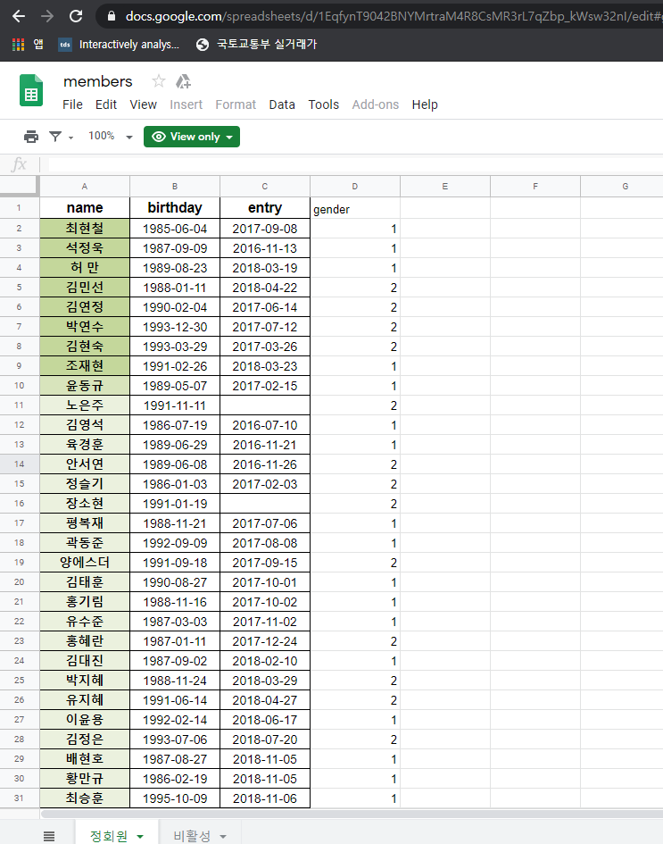
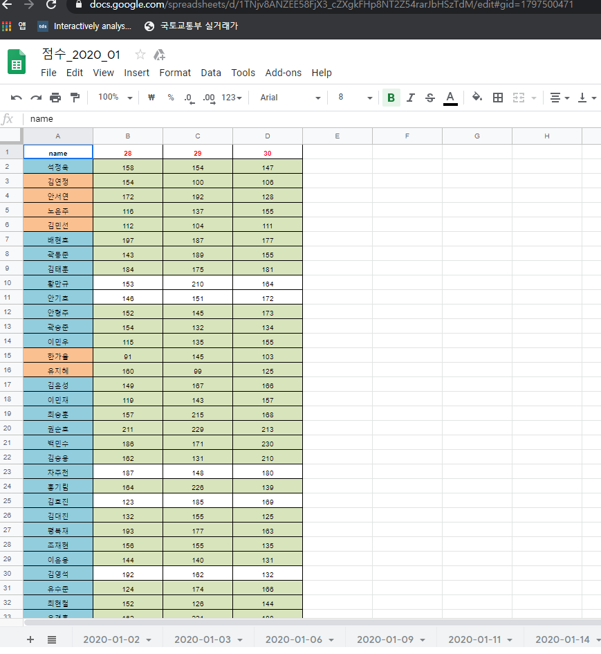
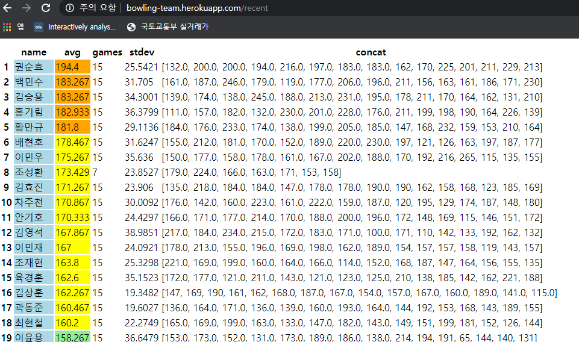

# Bowling Team Management

http://dq-27.herokuapp.com/bowling_team |

In an attempt to create a platform to utilize python to efficiently managage a sport team,

I found out that it is difficult to come up with a input system easy enough to attract new users.

As plan B, utilizing google sheet online available for users with ID and password made things straight forward and still manipulatable by python.

Utilizes google sheet as input and data management to efficiently manage scores and random team
generation for small competitions within the club.

To take a look around:
1. Visit first two pages "members" and "scores" to see what the platform utilizes as front end user's input.
 
2. Visit "recent" page and input 15 and submit, and page will result in table sorted by average score of members
    and highlited according to scores and gender.

3. "random" page will return table below when input following:

   Number of games: 30
   
   Number of teams 4
   
   Players: 김상훈,김승용,김연정,김영석,김유진,김윤성,김재훈,김정은,김주희,김지훈,김태훈,김한샘,김현숙,김효진,노은주,박민정,박연수,박지혜
   
   Allowable Difference: 50
   
   Which will return:
   
<html><head></head><body><table border="1" class="dataframe">
  <thead>
    <tr style="text-align: right;">
      <th>team</th>
      <th>1</th>
      <th>2</th>
      <th>3</th>
      <th>4</th>
    </tr>
  </thead>
  <tbody>
    <tr>
      <th>1</th>
      <td>김상훈/158.75</td>
      <td>김지훈/145.4</td>
      <td>김승용/178.36666666666667</td>
      <td>김효진/174.13333333333333</td>
    </tr>
    <tr>
      <th>2</th>
      <td>박지혜/137.5</td>
      <td>김주희/142.75</td>
      <td>김윤성/163.83333333333334</td>
      <td>김영석/166.2</td>
    </tr>
    <tr>
      <th>3</th>
      <td>김재훈/126.66666666666667</td>
      <td>박민정/120.66666666666667</td>
      <td>박연수/157.6</td>
      <td>김태훈/150.9</td>
    </tr>
    <tr>
      <th>4</th>
      <td>노은주/125.03333333333333</td>
      <td>김정은/112.43333333333334</td>
      <td>김현숙/139.83333333333334</td>
      <td>김연정/132.76666666666668</td>
    </tr>
    <tr>
      <th>5</th>
      <td>김한샘/115.42857142857143</td>
      <td>김유진/99.66666666666667</td>
      <td></td>
      <td></td>
    </tr>
    <tr>
      <th>total</th>
      <td>663.379</td>
      <td>620.917</td>
      <td>639.633</td>
      <td>624</td>
    </tr>
  </tbody>
</table></body></html>

Result is random team up of 18 people entered into 4 teams with respect to team total of recent 30 game average.
Notice the total values do not differ by more than 50 which was entered allowable difference value
